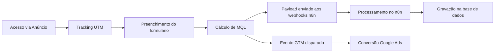

# ShopeeAds

> Landing page para captação e qualificação de leads para o treinamento de Shopee Ads — tráfego pago.


🌐 **[Ver página ao vivo](https://shopeeads.metodop4.com.br/)** · 📁 **[Repositório GitHub](https://github.com/taysouzaa/ShopeeAds)**

README de apresentação para GitHub.

## Visão do Projeto

O **ShopeeAds** foi construído para transformar tráfego pago em leads qualificados para o treinamento de Shopee Ads do Método P4, conectando aquisição, coleta de dados e automação em um fluxo único.

### O que o sistema resolve

- Evita perda de lead entre formulário e automação.
- Centraliza captação com validação de dados e qualificação pelo volume de faturamento e investimento em anúncios.
- Preserva origem de tráfego (UTM) para análise de performance de campanhas.
- Classifica automaticamente o lead como MQL (qualificado) ou não qualificado.

## O Que Foi Desenvolvido

### 1. Captação e Tracking
- Captura de origem (`channel`, `source`, `medium`, `campaign`, `content`, `referrer`, `page_url`) via script de tracking first-touch.
- Persistência de parâmetros UTM no navegador para reaproveitamento no submit.
- Limpeza automática de parâmetros UTM da URL após captura (`history.replaceState`).

### 2. Formulário de Qualificação
- Captura de nome, WhatsApp e confirmação de WhatsApp.
- Perguntas de qualificação: **faturamento mensal** e **investimento mensal em anúncios**.
- Validação local de consistência de telefone (WhatsApp e confirmação).
- Honeypot anti-bot para bloquear submissões automatizadas.
- Interface responsiva para mobile e desktop.

### 3. Lógica de Qualificação (MQL)
- `MQL = "Sim"` quando: faturamento ou investimento indicam perfil adequado para o treinamento.
- `MQL = "Não"` para leads fora do perfil ideal.
- Campo enviado no payload para os webhooks n8n.

### 4. Integração com Automação
- Envio de payload para dois webhooks n8n (novo formato e formato legado).
- Evento disparado no `dataLayer` do GTM com dados do lead e contexto do browser.
- Gravação na base de dados via n8n após recebimento do webhook.

### 5. Otimização de Assets
- Imagens convertidas para WebP (hero: 703 KB → 41 KB).
- Fotos de equipe comprimidas de originais acima de 13 MB para menos de 200 KB.
- Fontes Sora carregadas localmente com `font-display: swap`.
- Preload da imagem hero acima do fold com `fetchpriority="high"`.

## Stack Técnica

- **Frontend:** HTML5, CSS3, JavaScript (vanilla)
- **Integração:** Webhook n8n (direto, sem proxy)
- **Analytics:** Google Tag Manager, Google Analytics 4, Microsoft Clarity
- **Tipografia:** Sora (local, 6 pesos)
- **Ícones:** Font Awesome 6.5 (CDN com SRI hash)
- **Deploy:** HostGator/cPanel — upload manual

## Arquitetura (Resumo)

| Camada | Responsabilidade |
| --- | --- |
| `index.html` | LP principal — toda lógica, estilo e markup em arquivo único |
| `assets/` | Imagens otimizadas (WebP, JPG comprimido) |
| `fonts/` | Tipografia local (Sora) |
| `LICENSE` | Licença proprietária |

## Funcionamento do Sistema

1. Usuário acessa a LP via anúncio pago.
2. Tracking first-touch inicializa e persiste UTMs.
3. Usuário preenche formulário de qualificação.
4. Aplicação calcula MQL e monta payload com dados + tracking.
5. Payload é enviado para os webhooks n8n.
6. n8n processa e grava o lead na base de dados.
7. GTM dispara evento de conversão para Google Ads.



## Diferenciais de Engenharia

- Tracking first-touch desacoplado da lógica de formulário.
- Qualificação calculada no frontend antes do envio.
- Honeypot anti-bot embutido no formulário.
- Assets otimizados — página abaixo de 700 KB de imagens totais.
- CSS com design tokens (`--green`, `--dark`, `--section-blue`) para consistência visual.
- Animações com `IntersectionObserver` para reveal suave sem impacto em performance.
- `font-display: swap` garante texto visível durante carregamento das fontes.

## Estrutura do Projeto

```text
.
├─ assets/
│  ├─ hero.webp
│  ├─ equipe-p4.jpg
│  ├─ equipe-p4-reuniao.jpg
│  ├─ capa-video.webp
│  ├─ case-antes.jpg
│  ├─ case-depois.jpg
│  ├─ logo-p4-nav.webp
│  └─ logo-p4-footer.webp
├─ fonts/
│  └─ static/
├─ index.html
└─ LICENSE
```

## Deploy

- **HostGator/cPanel:** upload manual do conteúdo da pasta raiz via Gerenciador de Arquivos ou FTP.

## Licença

A licença **permanece inalterada** e segue os termos proprietários definidos em [LICENSE](./LICENSE).
